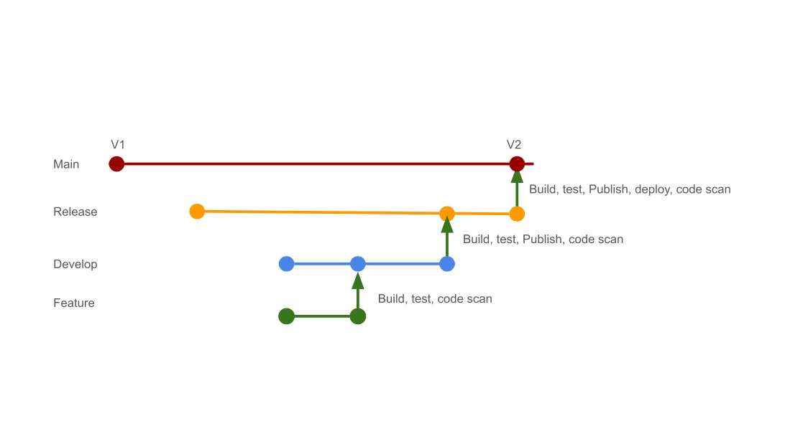

## Brief

This repository is used for CICD deployment using CircleCI. There are 3 branches - main, release & development. The CircleCI jobs triggered within each branch differs as follows:

## External Services

The following external SaaS services are used in the CICD process:

- CircleCI (CICD Platform)

## Commands

### circleci config validate

After installing CircleCI CLI tool locally, the `circleci config validate` command validates the config.yml file locally [[documentation]](https://circleci.com/docs/how-to-use-the-circleci-local-cli/#validate-a-circleci-config)
